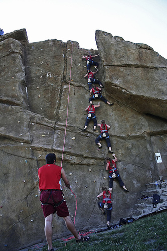
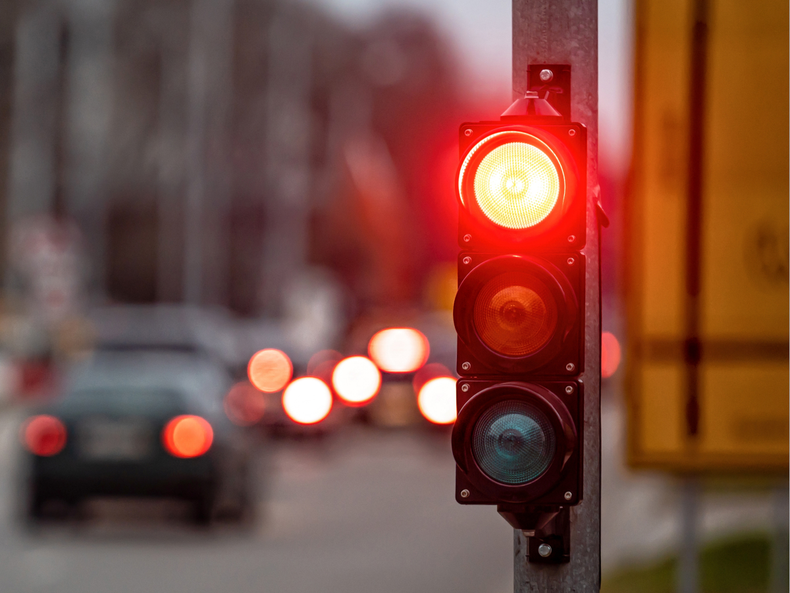

# 🖼️ AI-Captioning


Context ——> a group of climbers are climbing up a rock face.
Quotation ——> Reaching new heights, one step at a time: The unyielding spirit of climbers scaling the unforgiving rock face, defying gravity and conquering their fears, one foothold at a time.


Context ——> a red light is on a street corner.
Quotation ——> In the heart of the city, a solitary beacon of crimson light stands guard at the intersection, casting an inviting glow on the cobblestone streets below, reminding passersby of the promise of a new day and the hope that lies within the heart of every city dweller.


Context ——> a girl on a swing.
Quotation ——> Swinging through life with grace and ease, she dances in the wind, finding joy in the simplest of moments.


Generate **captions** and **inspirational quotes** from images — auto-magically.

---

## 🔍 What it does

Given an input image, the model:
1. Understands the **context** using a vision-language model.
2. Generates:
   - 🧠 A deep AI-generated **caption**
   - 📜 A relevant **quote** by a famous personality

Use case: Perfect for **Instagram**, **content creators**, or **motivational posts**.

---

## 🧠 Tech Stack

- Python
- [BLIP](https://github.com/salesforce/BLIP)  (Bootstrapped Language Image Pretraining)
- Transformers & Mistral(Hugging Face)  (for quote generation)
- Pillow, Matplotlib
- PyTorch

---

## 🚀 How to Run

```bash
git clone https://github.com/your_username/AI-Captioning.git
cd AI-Captioning

# (Optional) Create a virtual environment
python -m venv venv
source venv/bin/activate  # or venv\Scripts\activate

pip install -r requirements.txt

# Run the pipeline
python generate.py
